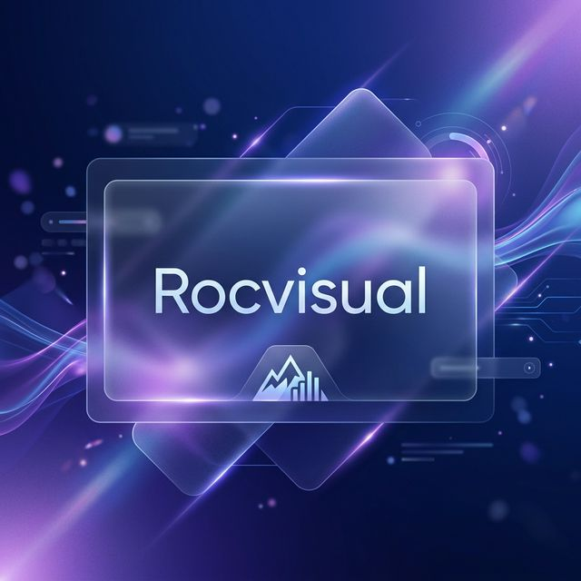

# 🚀 Rocvisual - SaaS Platform

**Rocvisual** is a premium, high-end SaaS platform for managing and highlighting intelligent advertisements. Designed with a modern **Glassmorphism** aesthetic, it provides users with a seamless and visually stunning experience for publishing their commercial content.

## 🌐 Live Presence
- **Official Domain**: [https://www.rocvisual.es](https://www.rocvisual.es)
- **Production Server**: [https://platarfoma-sas.onrender.com](https://platarfoma-sas.onrender.com)

## ✨ Features
- **Premium UI**: Advanced CSS layouts with blurred glass effects and smooth transitions.
- **Secure Auth**: JWT-based authentication system with encrypted passwords (bcrypt).
- **Lightweight DB**: SQLite-driven persistence for high performance and zero-configuration deployments.
- **SEO Optimized**: Fully compliant with Open Graph and Twitter Card standards for social media sharing.

## 🛠️ Technology Stack
- **Frontend**: Vanilla JavaScript, HTML5, Modern CSS (Flexbox/Grid).
- **Backend**: Node.js, Express.
- **Database**: SQLite.
- **Infrastructure**: Render (Hosting), GitHub (CI/CD), IONOS (DNS Management).

---
*Created with ❤️ for Rocvisual Digital Portfolio.*
